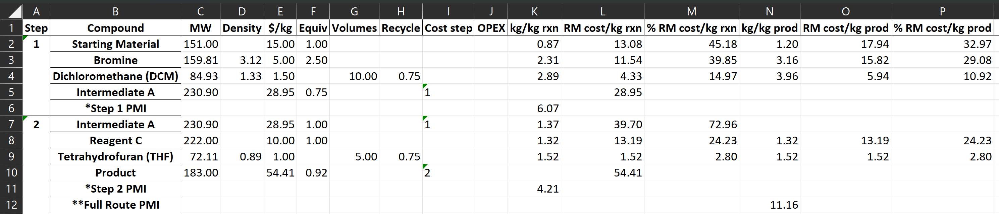
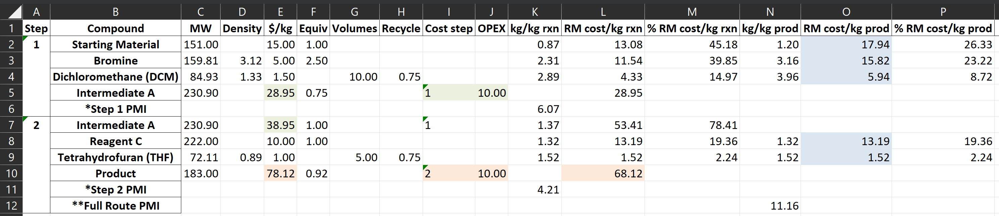

Interpreting Costing Results
============================

After creating an Excel file for the route, as :ref:`described in the previous
section <tablesbasics>`, the `web application interface
<https://costcalc.rnelsonchem.com/>`_ can be used to run the route costing
algorithm to create a new dynamic Excel output file.  The instructions for
that process are provided on the main web application page, so they will not
be repeated here. A lightly formatted output for our demo route (see previous
section) is shown below. (Two columns are not being shown at the end of the
file. Those simply contain the Materials and Reactions Notes, which were
transferred unchanged from the input file.)

Calculated RMCs
---------------

Columns A-K are translated directly from the input tables with one important
exception; the *$/kg* values for the two reaction products (cells E5, E7, and
E10) are now the total raw material costs (RMCs) for those two compounds. The
RMC for the route is $54.41/kg, which is the value for the overall product of
the route (cell E10). All three of these cells are fully dynamic because they
are stored in the cell as equations rather than hard-coded values. So changes
in other parts of the worksheet should cause these values to be recalculated.
(Keep in mind, though, that the original input file and this new output file
are not connected in any way, so changes here will not be reflected in the
input file.)

Per kg Rxn Columns
------------------

The values in Excel columns L-N are per 1 kg of *reaction* product, in that
they should be interpreted on a per reaction basis and not for the entire
route. Brief descriptions of these columns are below.

* *kg/kg rxn*: These values are the number of kgs that are needed for each
  reagent/solvent in order to make 1 kg of reaction product. Notice that the
  number of kgs of reaction product is always 1.0.

* *RM cost/kg rxn*: These are the costs ($/kg) for each reagent/solvent that
  would be needed to make 1 kg of reaction product. This is simply the *kg/kg
  rxn* column multiplied by the *$/kg* column. The sum of these values would
  be the RMC for each reaction product.

* *% RM cost/kg rxn*: These are the *RM cost/kg rxn* expressed as percentages
  of the RMC for the reaction product. In other words, this is the *RM cost/kg
  rxn* column values divided by the reaction product RMC. For each individual
  reaction, these values should add up to 100%. 

Per kg Prod Columns
-------------------

The values in Excel columns O-Q are per 1 kg of *route* product, so these
values should be interpreted for the entire route. Brief descriptions of these
columns are below.

* *kg/kg prod*: The number of kgs needed for each reagent/solvent in order to
  synthesize 1 kg of the final product of the route.

* *RM cost/kg prod*: The RM cost contribution ($/kg) of each reagent/solvent
  to the RMC of the route product. This is simply *kg/kg prod* multiplied by
  the *$/kg* column. The sum of these values across the entire route should
  equal the RMC of the route product, *unless* OPEX is being added to one or
  more reaction steps. 

* *% RM cost/kg prod*: Again, this is simply the *RM cost/kg prod* expressed
  as a percentage of the RMC for the overall route product. The sum of these
  values across the entire route should be 100%, *unless* OPEX is being added
  to one or more reaction steps.

PMI Values
----------

Three rows have been added to the output table to reflect the process mass
intensity (PMI) for each reaction (rows 6 and 11) and the overall route (row
12). PMI can be defined as the number of kgs of materials needed to make 1 kg
of product. This is a common metric for process waste, as larger PMI values
can be interpreted as more materials being used, and potentially wasted, to
create 1 kg of product. These values are shown in different columns because
the per reaction PMI is calculated from the *kg/kg rxn* data, whereas the per
route PMI is calculated from the *kg/kg prod* data. 

.. note:: 
   
   The PMI calculations as implemented by *costcalc* may not be strictly
   correct, because the solvent recycling is factored into the calculation.
   The final PMI here only considers solvent masses that go to waste (are not
   recycled), whereas a true PMI may not always consider recycling. To get
   these PMI values, you can simply set the solvent recycling parameters ("Sol
   Recyc" column) to zero for all solvents, and the Excel file will
   recalculate the PMI parameters. These all-solvent PMI values will likely be
   dominated by solvent usage, though.

OPEX Additions
--------------

The costing output for our demo model with a $10/kg OPEX added to each step is
shown below. Some cells have been color coded for the coming discussion. In
order to re-create this model, the OPEX value needs to be set for the reaction
products in the input Route tables, as described in the :ref:`OPEX input
<OPEXinput>` section. As a reminder, these values are only valid for reaction
product rows. 

The way the OPEX is handled for intermediate reactions is shown by the values
highlighted in green. The initial RMC for Intermediate A in Step 1 is $28.95
(cell E5), which is simply the sum of the raw material costs as per usual.
However, in Step 2, the OPEX value is added to this number, i.e. $38.95 (cell
E7). Because the OPEX values are added in this manner, they will be modulated
based on intermediate utilization and reaction yield in subsequent steps. This
will be demonstrated below. 

The OPEX is handled a little differently for the final product of the route,
as highlighted in red. In that case, the OPEX is added directly to the final product
RMC in the *$/kg* column (cell E10). This can be see by comparing the *RM
cost/kg rxn* for the final product (cell M10), which is the raw materials-only
value and the *$/kg* value (cell E10). 

Separating the contribution of the OPEX costs from the raw materials is
relatively straightforward. The sum of the *RM cost/kg prod* column
(highlighted in blue) is the RMC for the final product, in this case
$54.41/kg. The difference with the value in the *$/kg* column is $23.71/kg,
which is the cumulative contribution of the OPEX values. Notice that the OPEX
contribution for the first step is more than the original $10/kg, which is due
to the yield losses and material utilization as described above. 

The percentage columns for this new model deserve some explanation. The *% RM
cost/kg rxn* values are relative to the RMC-only values (i.e. without
factoring in the OPEX), so you'll see that these numbers still sum to 100% for
each reaction. However, the *% RM cost/kg prod* column is now relative to the
final OPEX-included $/kg value, so the sum of the % values is less than 100%.
However, the relative contributions from each component will remain the same,
regardless of whether the OPEX is added or not.

