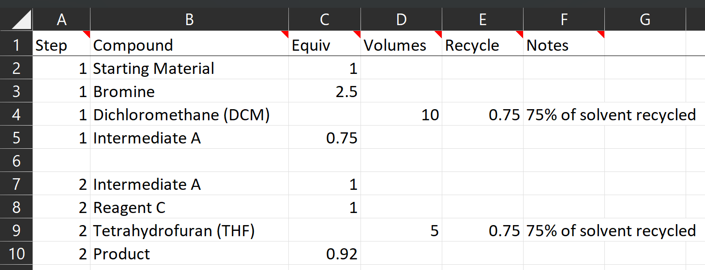
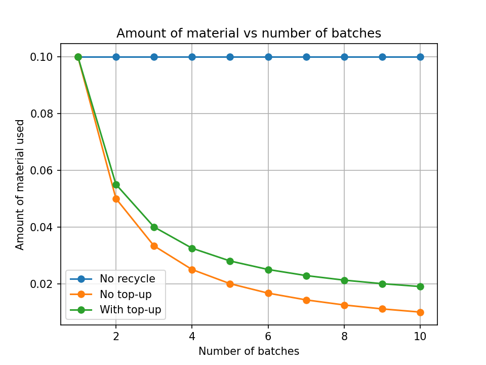

.. _tablesbasics:

Translate Route Into Tables
===========================

A simple two-step demo synthetic route that will be used in this documentation
is shown below. The utilization of the reagents and solvents is being shown as
molar equivalents and volumes (L/kg), respectively, which would have been
determined in the lab. Fake prices ($/kg) of some compounds are provided as
well. **In essence, the costcalc2 algorigthm will use this information to
calculate the unknown raw material cost (RMC, in $/kg) values for Intermediate
A and Product.** As part of this calculation, process mass intensity (PMI)
will also be calculated as a measure of route waste. Note: All of the
information in this figure is fake and is provided for pedagogical purposes
only.   

Notes on Pricing
----------------

It is important to understand that the *costcalc* algorithm takes price
information for reagents and solvents and calculates *total raw material costs
(RMCs)* for the intermediates and products. In a simplified sense, these RMCs
are the sum of the raw material prices used to synthesize the route
intermediates/product. However, RMCs are only one component of the final price
of a compound, in addition to labor, facilities charges, waste disposal,
profit margin, etc. So **the RMC for the final product is NOT the expected
sales price** and needs to be interpreted with that knowledge in mind.

Accurate raw material prices are a key component of the calculation, and they
are not always trivial to obtain. Prices are highly dependent on the scale,
region where purchase, date when prices were quoted, etc. As such, no price
information (or material information of any kind) is provided in the
*costcalc* module. 

Tables Overview
---------------

The *costcalc* algorithm, including the `web application
<https://costcalc.rnelsonchem.com/>`_ interface, require the chemical
synthetic route information above to be converted into two different input
tables. A "Materials" table will contain all of the information about the raw
materials, such as molecular weight, density, and price. A "Route" table will
contain the route-specific information, such as equivalents of reagents,
volumes of solvent, etc. These tables require some specific formatting, which
will be outlined here. The web application uses an Excel file as the tabular
input. A :download:`blank template <./_downloads/blank_v3.xlsx>` is provided
here, which contains the proper column names and tabs as well as well as some
conditional formatting to help guide user input. A complete :download:`working
Excel file <./_downloads/working_v4.xlsx>` containing this demo route
information is also available.

Materials Table
---------------

The Materials table will be added to the Materials tab in the Excel file, and
this must be populated first. (This is because of some data validation that is
done to ensure correct inputs in the Route tabs.) For the web application,
there should be only one Materials tab per Excel file and the name of the tab
must remain unchanged. Although this table must contain all of the materials
for the synthetic route to be costed, it can contain any arbitrary number of
additional materials as well. This can be seen in the completed Excel file
that can be downloaded above. 

A snapshot of a completed Materials table for this demo route, along with some
additional materials, is shown below. Detailed column descriptions are given
in the next paragraph, but a few general notes are provide here. First, the
order of the materials in this table is not important. In this demo, the
compounds with known prices were separated from compounds without known prices
for clarity.  Second, blank lines and formatting are ignored, which can be
helpful to make the input file a little easier to understand. In this case, a
blank line between known/unknown compounds has been added, and clarifying
comments have been added to the column name cells. However; be careful about
adding inadvertent information into "blank" lines. For example, if information
was added into cell E9 below, the costing calculation will fail with an error.
Some of these notes do not apply to the Python programming interface to the
*costcalc* algorithm, as will be discussed in later sections.   

.. image:: ./_images/materials.png
   :align: center

The Materials table contains the following columns, which must be present.
Additional user-defined columns can be added, but will be ignored by the
*costcalc* algorithm.

* *Compound*: This is the desired name for the compounds in the route. These
  names must be unique, i.e. there can not be two compounds with the same
  name. As stated above, at a minium, all of the compounds for the route need
  to be defined; however, any number of additional compounds can be present.
  Starting a compound name with the number sign (#) will comment out that row,
  so it will be ignored when the table is processed. This can be useful if you
  want to maintain historical records of prices, for example. 

* *MW*: The molecular weight of the compound in kg/kmol (equivalent to
  g/mol). Every compound must have a MW, so if a compound name is given, the
  MW column will be highlighted automatically to indicate that this value must
  be provided. This value can be a little tricky for materials like celite,
  which may not have a defined MW. Some notes for corner cases like this is
  provided below.

* *Density*: The density of the compound in kg/L (equivalent to g/mL). This
  value is only mandatory for compounds that will be used as solvents, as
  described in the Route table section, otherwise they can be left blank. If a
  density is added for a non-solvent reagent, it will be ignored.

* *$/kg*: The price of the compound in $/kg. Most compounds will need to have
  a defined price with the following exception. If the compound represents a
  product of a reaction, then the price is optional. In these cases a price
  can be provided, if desired, but it may be ignored during the calculations. 

* *Notes*: (Optional) Notes for the compound information. For example, this is
  a good place to add the date and source of the pricing information and the
  name of the person who acquired that information.

Route Table
-----------

The route information is added into a separate tab in the Excel file with the
required columns described in the list below. There can be one or more route
tabs per Excel file, and the tab names can be arbitrarily chosen (except for
the name "Materials" as described above). In the blank template file, the
route tab is called "Route 1"; in the working demo file, the route tab has
been renamed to "Bromine Route". If a new route tab is desired, the column
names are the most critical component that needs to be copied. However, the
route tabs in the Excel files provided here do contain some conditional
formatting and data validation to ensure that values are added correctly, so
if using the provided template files, it is recommended to use the "Move or
copy..." dialog (accessed by right-clicking on the tab name) to duplicate a
current route tab.

A snapshot of the Route table for the demo route above is shown below.
Although not shown, pictures (ChemDraw or regular images files) of the route
can be added to this tab, and they will be ignored by the *costcalc*
algorithm. However, duplicate materials in a single reaction are *NOT*
allowed, and this will cause an error. For example, if three extractions with
ethyl acetate are used, the extraction volumes need to be added together and
entered as a single row.

Descriptions of the Route columns are provided in the list below. As with the
Materials table, additional user-defined columns or blank lines can be added
(:ref:`with one exception <massinput>`), but they will be ignored during the
costing operation.

* *Step*: An unique identifier to delineate the synthetic step in the route.
  These can be simply numerical numbers (e.g. 1, 2, 3) and/or text ("1a" or
  "Int A"). Steps do not need to be added into the table in any particular
  order, as they will be automatically sorted during the costing calculation.
  In fact, the compounds from every step could be added in arbitrary order;
  however, this is not recommended from a clarity standpoint.  Starting a Step
  with the number sign (#) will comment out that row, so it will be ignored
  when the table is processed.  

* *Compound*: The name of a reagent/solvent/product for the step. These names
  must *exactly* correspond to the Materials table, so a drop-down selector is
  provided to ensure that a valid name is selected. (This is why the Materials
  table should be created first.) As noted above, duplicate compound names are
  *NOT* allowed per Step, so multiple usages of the same compound in one Step
  (e.g.  extraction solvent) should be added into one entry.

* *Equiv*: Molar equivalents of a reagent or product. Although this value can
  be used for solvents, it is more common to define solvent utilization with
  *Volumes*, as described in the next column. These values can be scaled as
  needed, but they are typically scaled such that the limiting reagent is 1
  equivalent. For a product, the equivalents are the theoretical equivalents
  multiplied by the fractional percent yield. For example, in a reaction with
  a starting material to product ratio of 1:1 and a 75% yield of product, the
  equivalents of product would be :math:`1*0.75=0.75`. If 2 moles of product
  are expected (e.g. breaking up a dimer) with the same reaction yield, the
  equivalents of product would be :math:`2*0.75=1.5`.

* *Volumes*: The amount of solvent utilization in volumes. This value is only
  required if *Equiv* for a particular compound is not given; if this column
  is used, the next two columns (*Relative* and *Sol Recyc*) are required. The
  unit for volumes is L/kg, which can be interpreted as "liters of this
  solvent per kg of a reference compound." This is numerically equivalent to
  mL/g. The reference compound is defined in the next column. 

* *Relative*: The reference compound for solvent volume calculations. This is
  typically the starting material/limiting reagent of the reaction, but that
  may not always be the case. Again, the name here must correspond to a
  compound from the Materials table; this cell contains a drop-down selector to
  ensure that a valid compound name is selected. The material name must also
  be defined in the current reaction *Step*, otherwise the cost calculation
  will result in an error.

* *Sol Recyc*: The fractional percentage of this solvent that it is expected
  could be recycled. For example, if 95% of the solvent can be recycled, then
  this cell will contain the value 0.95. In our demo example, we are assuming
  that 75% of the solvents can be recycled; however, if you are unsure, set
  this value to 0, which means that none (0%) of this solvent can be recycled.

* *Cost Step*: The step identifier that indicates where the RMC for this
  compound will be calculated. The value here must be a valid entry from the
  *Step* column, and these entries are only necessary for route intermediates
  and the overall product. (I.e. any compound that does not have a $/kg entry
  in the Materials table.) This column is critical as it provides a "roadmap"
  of sorts to define how the different reactions are connected. In our demo
  example, the RMC for Intermediate A is calculated in step "1", so *all
  usages of Intermediate A must be labeled as "1"*. A simplified version of a
  longer linear and convergent route :ref:`are provide below <linVSconv>` for
  additional demonstration purposes.

.. _OPEXinput:

* *OPEX*: (Optional) An estimate, in $/kg, of the operating expenses for a
  given reaction step. This number is only valid for the product of any given
  step.  Although these values are not given for the current demo route, they
  could have been given for Intermediate A in Step 1 (Cell H5) and/or Product in
  Step 2 (cell H10). For route intermediates, these values are added to the
  RMC values in subsequent steps; the OPEX for the final product is added to
  the final RMC value in the *$/kg* column. This can be a bit confusing at
  first, so a :ref:`second model using OPEX values <OPEX>` will be presented
  in the next section. 

* *Notes*: (Optional) Notes for this particular compound. For example, a
  reference can be included here if the reaction was taken from the
  literature, or a short bit of text can be added to acknowledge any
  assumptions in the numbers.

.. _linVSconv:

Linear vs Convergent Syntheses
______________________________

The *Step* and *Cost Step* columns and their connections are vital to ensure
that the route is costed correctly. Using these connection schemes we can also
define routes of arbitrary number of steps and level of convergence. Below are
two very simplified Route tables for the products of two different three-step
synthetic routes. One is completely linear and the other is convergent. 

Below is the simplified Route table for the products of a three step linear
route, which is shown in the figure as well. The identifiers in the *Step* and
*Cost Step* columns have been color coded for additional clarity.

.. image:: ./_images/3step_linear.png
   :align: center

The next figure is a simplified Route table for the products of a convergent
three-step route, as shown. Again, color coding is added to clarify values
that must be the same.

.. image:: ./_images/3step_conv.png
   :align: center

.. _massinput:

Mass-based Inputs
_________________

In some cases (e.g. using scale-up batch records), it is more convenient to
input the amounts of materials as masses rather than equivalents/volumes. This
can be done by adding a new column named "Mass" to the Route table. This
column can be populated by mass values in metric mass units (g, kg, metric
ton, etc.), as long as the units are the same for all values. In the
*costcalc* code, these mass values are converted back to equivalents/volumes,
which is somewhat counter-intuitive, but must be done for algorithmic
purposes. As a result, there are some important notes here, which are given
roughly order of importance.

#. *Masses can be added on a per reaction basis.* This means that masses can
   be given for one or more reactions in the synthetic route, rather than
   having to define masses for every reaction. This can be helpful if you want
   to mix and match reaction information from different sources.

#. *The first compound in a reaction is assumed to be the limiting reagent,
   and the mass must be given for this compound.* Some mixing and matching of
   masses/equivalents/volumes is allowed (below), but this only works if the
   first compound follows the rule defined here.

#. *Mass values override equivalent and volume values.* If a single compound
   defines an equivalent/volume value and a mass, the mass will be converted
   into an equivalent/volume and will override the original value. This makes
   it possible, for example, to double check that the conversions are correct,
   but it may lead to some unexpected behavior if you don't check the tables
   carefully.

#. *Mixtures of masses and equivalents/volumes are acceptable.* For example,
   solid reagents could be included as masses with solvents given as volumes;
   however, the two rules above must be followed.

#. *Solvent masses are converted to equivalents, unless the "Relative"
   compound and "Sol Recyc" parameter are also defined.* This is important if
   you want to factor in solvent recycling.  When a "Relative" compound name
   is provided along with a mass, the *costcalc* code will convert the mass
   into volumes, which are affected by the solvent recycling parameter.

Below is a picture of a example Route table for our demo route using a *Mass*
column; this table will give the same results in the *costcalc* costing
routine. (The color coded cells are due to the conditional formatting in the
template Excel files.) Notice that only one reaction has been given mass
values (note #1 above). The amount of intermediate A was only given in percent
yield (75%), so no mass has been given (note #4 above). Note: the *Mass*
column will be dropped from the results table/Excel file.

.. image:: ./_images/br_route_mass.png
   :align: center

Special Case Inputs
--------------------

kg/kg Solid Charges
___________________

Some solids - celite, heterogeneous catalysts, silica - may be charged into a
reaction on a (kg solid)/(kg limiting reagent) basis. These materials may not
have well-defined MW values, which makes these inputs a little tricky. One way
to handle this is to make the MW of this compound the same as the limiting
reagent for the step where it is being used. When two compounds have identical
molecular weights, the molar equivalents are identical to a kg/kg ratio.

For example, if Pd/C was being used in a 0.1 kg/kg ratio in the second step of
our demo route, we could set the MW of Pd/C in our Materials table to be the
same as Intermediate A, or 230.9. Then the equivalents value for Pd/C in the
Route table would be 0.1.

If the solid is used in more than one reaction, you can may need to make
multiple entries for the solid in the Materials table. Because the materials
must have unique names, you could give them identifiers to associate them with
a particular limiting reagent. In our example above, for example, you may want
to use the name "Pd/C_IntA" and "Pd/C_SM" for Pd/C with molecular weights for
Intermediate A (Step 2) and Starting Material (Step 1), respectively.

Recyclable Solids
_________________

Some solid materials can be recycled in two or more runs of the same reaction.
This won't be the same as solvent recycling, so you'll have to use a little
math to get the correct equivalent amounts for these compounds. As you'll see,
some additional data may need to be assumed or empirically determined in the
lab. 

If a material is simply being reused over several batches, the math is pretty
simple. For the expected number of usages (:math:`n`), the scaled equivalents
(:math:`eq_{scaled}`) will just be the initial equivalents (:math:`eq_{init}`)
divided by the number of usages.

.. math::

   eq_{scaled} = \frac{eq_{init}}{n}

In real situations, it may be hard to fully reuse all of the original
material, so some extra material should be added on each subsequent run, a
so-called "top-up" addition, to account for lost material. If this top-up is
given as a fractional percentage of the original addition (:math:`per_{tu}`),
then the top-up amount (:math:`eq_{tu}`) for a given number of usages
(:math:`n`) is as shown below.  The less one for the number of usages takes
into account that the first usage will not require a top-up addition. 

.. math::

   eq_{tu} = eq_{init}*per_{tu}*(n - 1)

These two equations can be combined to give the scaled equivalents given a
certain number of material usages and a small top-up.

.. math::

   eq_{scaled} &= \frac{eq_{init}}{n} + eq_{init}*per_{tu}*(n - 1) \\
               &= \frac{eq_{init}*(1 + per_{tu}*(n^2 - n))}{n}

We can use some simple Python code to visualize the difference between these
different scenarios. In this model, the material is a catalyst, so its amount
relative to the limiting reagent is 10% (``eq_init``). We will assume that
this material can be recycled up to 10 cycles (``n``), but that each
subsequent recycle requires that 10% of the initial amount of catalyst is
added as a top-up (``top_up``). The simulation code for this scenario and the
resulting plot are shown below.

.. code-block:: python

   import numpy as np
   import matplotlib.pyplot as plt
   
   eq_init = 0.1
   n = np.arange(1, 11)
   per_tu = 0.1
   
   no_recyc = load*n # Assuming a new batch of material in each run
   simple = load/n # Assuming a simple recycle of material per run
   top_up = load*(1+per*(n**2 - n))/n # With top-up
   
   plt.plot(n, no_recyc, 'o-', label='No recycle')
   plt.plot(n, simple, 'o-', label='No top-up')
   plt.plot(n, top_up, 'o-', label='With top-up')
   
   plt.title('Amount of material vs number of batches')
   plt.xlabel('Number of batches')
   plt.ylabel('Amount of material used')
   plt.legend()
   
   plt.grid()
   plt.show()

